# 🏗️ RN Net Vision - Architecture Flow Guide

> **Comprehensive Web-Viewer Architecture Guide**
>
> A complete component-based architecture blueprint for the RN Net Vision web-viewer Vite project, following modern React/Preact patterns with TypeScript, TailwindCSS, and atomic design principles.

---

## 📋 Table of Contents

- [🎯 Architecture Philosophy](#-architecture-philosophy)
- [🏗️ Project Structure](#️-project-structure)
- [🧩 Component Architecture (Atomic Design)](#-component-architecture-atomic-design)
- [🔄 Data Flow Patterns](#-data-flow-patterns)
- [🎨 Styling & Theme System](#-styling--theme-system)
- [⚡ State Management](#-state-management)
- [🔗 Hook Patterns](#-hook-patterns)
- [📦 Build & Configuration](#-build--configuration)
- [🚀 Performance Optimization](#-performance-optimization)
- [📊 Development Guidelines](#-development-guidelines)

---

## 🎯 Architecture Philosophy

### Core Design Principles

1. **Atomic Design Methodology**: Components are organized in a hierarchical structure (Atoms → Molecules → Organisms)
2. **Component-Driven Development**: Each component is self-contained with clear responsibilities
3. **TypeScript-First**: Strict typing for better DX and runtime safety
4. **Hook-Based Logic**: Custom hooks for reusable business logic
5. **Context-Driven State**: React Context for cross-component state management
6. **Performance-Oriented**: Minimal re-renders through optimized patterns

### Technology Stack

```typescript
// Core Framework
Framework: Preact 10.26.2          // React-compatible, lighter bundle (~3KB)
Language: TypeScript               // Strict type safety
Build Tool: Vite 6.2.0            // Fast development & optimized builds
Styling: TailwindCSS 4.1.7        // Utility-first CSS framework
Animation: Framer Motion 12.9.4   // Declarative animations
```

---

## 🏗️ Project Structure

```
web-viewer/
├── 📁 public/                     # Static assets
├── 📁 src/
│   ├── 📁 components/             # Component library (Atomic Design)
│   │   ├── 📁 atoms/              # Basic building blocks
│   │   ├── 📁 molecules/          # Simple component combinations
│   │   └── 📁 organisms/          # Complex UI sections
│   ├── 📁 context/                # React Context providers
│   ├── 📁 hooks/                  # Custom React hooks
│   ├── 📁 types/                  # TypeScript type definitions
│   ├── 📁 utils/                  # Utility functions
│   ├── 🔧 app.tsx                 # Main application component
│   ├── 🔧 main.jsx                # Application entry point
│   └── 🎨 index.css               # Global styles
├── 📄 package.json                # Dependencies & scripts
├── ⚙️ vite.config.js              # Vite configuration
├── ⚙️ tailwind.config.cjs         # TailwindCSS configuration
└── ⚙️ tsconfig.json               # TypeScript configuration
```

### Directory Responsibilities

| Directory    | Purpose                                   | Examples                                         |
| ------------ | ----------------------------------------- | ------------------------------------------------ |
| `/atoms`     | Single-purpose UI elements                | Button, Badge, Input, Toast                      |
| `/molecules` | Combined atoms for specific functionality | FilterPanel, ActionButtons, ThemeToggle          |
| `/organisms` | Complete UI sections                      | Header, NetworkLogList, NetworkLogs              |
| `/context`   | Global state management                   | ThemeProvider, DeviceContext, ToastContext       |
| `/hooks`     | Reusable business logic                   | useWebSocket, useFilteredLogs, useTheme          |
| `/types`     | TypeScript interfaces                     | NetVisionLog, WebSocketMessage, ThemeContextType |
| `/utils`     | Pure utility functions                    | timeUtils, networkUtils, styleUtils              |

---

## 🧩 Component Architecture (Atomic Design)

### Atomic Design Hierarchy

```mermaid
graph TD
    A[🔬 Atoms] --> M[🧪 Molecules]
    M --> O[🏗️ Organisms]
    O --> T[📄 Templates]
    T --> P[📱 Pages]
```



### 🔬 Atoms (Basic Building Blocks)

**Purpose**: Smallest, indivisible UI components

**Examples**:

```typescript
// Button.tsx - Reusable button with variants
interface ButtonProps {
  onClick?: () => void;
  variant?: 'primary' | 'secondary';
  size?: 'sm' | 'md' | 'lg';
  disabled?: boolean;
  children: ComponentChildren;
}

// StatusBadge.tsx - HTTP status visualization
interface StatusBadgeProps {
  status: number;
  size?: 'sm' | 'md';
}

// MethodBadge.tsx - HTTP method display
interface MethodBadgeProps {
  method: string;
  size?: 'sm' | 'md';
}
```

**Characteristics**:

- ✅ No dependencies on other components
- ✅ Highly reusable across the application
- ✅ Props-driven with clear interfaces
- ✅ Focused styling with Tailwind classes

### 🧪 Molecules (Component Combinations)

**Purpose**: Groups of atoms functioning together as a unit

**Examples**:

```typescript
// FilterPanel.tsx - Search + filters combination
interface FilterPanelProps {
  onFilterChange: (filters: FilterState) => void;
  deviceCount: number;
}

// ActionButtons.tsx - Multiple related actions
interface ActionButtonsProps {
  onClear: () => void;
  onExport?: () => void;
  disabled?: boolean;
}

// BadgeRow.tsx - Status + method + duration badges
interface BadgeRowProps {
  log: NetVisionLog;
  compact?: boolean;
}
```

**Characteristics**:

- ✅ Composed of multiple atoms
- ✅ Domain-specific functionality
- ✅ Handle intermediate state logic
- ✅ Responsive design considerations

### 🏗️ Organisms (Complex UI Sections)

**Purpose**: Complete interface sections with sophisticated functionality

**Examples**:

```typescript
// NetworkLogs.tsx - Main application interface
interface NetworkLogsProps {
  logs: NetVisionLog[];
  onClear: (deviceId?: string | null) => void;
}

// Header.tsx - Application header with controls
interface HeaderProps {
  isConnected: boolean;
  isDarkMode: boolean;
  toggleDarkMode: () => void;
}

// NetworkLogList.tsx - Complete log display system
interface NetworkLogListProps {
  logs: NetVisionLog[];
  onClear: () => void;
  onSelectLog: (log: NetVisionLog | null) => void;
  selectedLog: NetVisionLog | null;
}
```

**Characteristics**:

- ✅ Orchestrate molecules and atoms
- ✅ Handle complex business logic
- ✅ Manage local component state
- ✅ Integrate with global context

---

## 🔄 Data Flow Patterns

### Unidirectional Data Flow


### State Flow Architecture

```typescript
// 1. Data Source (WebSocket)
const { logs, isConnected, clearLogs } = useWebSocket();

// 2. Data Processing (Filtering)
const filteredLogs = useFilteredLogs(logs, activeDeviceId);

// 3. Data Transformation (Sorting)
const sortedLogs = useSortedLogs();

// 4. UI State Management (Selection)
const selection = useLogSelection(sortedLogs.sortedLogs);

// 5. Component Rendering
<NetworkLogList
  logs={filteredLogs}
  selectedLog={selection.selectedLog}
  onSelectLog={selection.handleSelectLog}
/>
```

### Context Architecture

```typescript
// App.tsx - Provider hierarchy
export default function App(): VNode {
  return (
    <ErrorBoundary>
      <ToastProvider>          // 🍞 Notifications
        <DeviceProvider>       // 📱 Device management
          <ThemeProvider>      // 🌗 Theme state
            <AppContent />     // 🎯 Main application
          </ThemeProvider>
        </DeviceProvider>
      </ToastProvider>
    </ErrorBoundary>
  );
}
```

---

## 🎨 Styling & Theme System

### TailwindCSS Design System

**Color Palette**:

```css
/* Primary Colors */
--blue-500: #3b82f6 /* Primary actions */ --indigo-500: #6366f1
  /* Secondary actions */ --gray-500: #6b7280 /* Neutral elements */
  /* Status Colors */ --green-500: #10b981 /* Success (2xx) */
  --yellow-500: #f59e0b /* Warning (3xx) */ --red-500: #ef4444
  /* Error (4xx, 5xx) */ /* Method Colors */ --emerald-500: #10b981 /* GET */
  --blue-500: #3b82f6 /* POST */ --amber-500: #f59e0b /* PUT */
  --red-500: #ef4444 /* DELETE */;
```

**Spacing System** (4px base unit):

```css
/* Spacing Scale */
p-1: 4px    p-2: 8px     p-3: 12px    p-4: 16px
p-6: 24px   p-8: 32px    p-12: 48px   p-16: 64px
```

### Theme Implementation

```typescript
// Theme Context Pattern
export const ThemeContext = createContext<ThemeContextType>({
  isDarkMode: false,
  toggleDarkMode: () => {},
});

// Theme Hook
export function useTheme() {
  const [isDarkMode, setIsDarkMode] = useState(() => {
    const saved = localStorage.getItem('theme');
    return (
      saved === 'dark' ||
      (!saved && window.matchMedia('(prefers-color-scheme: dark)').matches)
    );
  });

  useEffect(() => {
    document.documentElement.classList.toggle('dark', isDarkMode);
    localStorage.setItem('theme', isDarkMode ? 'dark' : 'light');
  }, [isDarkMode]);
}
```

### Component Styling Patterns

```typescript
// Glassmorphism Effect
const glassClasses = [
  'backdrop-blur-sm',
  'bg-white/10 dark:bg-gray-900/20',
  'border border-white/20 dark:border-gray-700/30',
  'shadow-lg shadow-black/5 dark:shadow-black/20',
].join(' ');

// Interactive States
const interactiveClasses = [
  'hover:bg-white/20 dark:hover:bg-gray-800/30',
  'active:scale-95',
  'transition-all duration-200',
  'focus:outline-none focus:ring-2 focus:ring-blue-500/50',
].join(' ');
```

---

## ⚡ State Management

### Hook-Based State Architecture

```typescript
// Custom Hook Pattern for Business Logic
export const useWebSocket = () => {
  const [logs, setLogs] = useState<NetVisionLog[]>([]);
  const [isConnected, setIsConnected] = useState(false);
  const socketRef = useRef<WebSocket | null>(null);

  // Connection management
  const connect = useCallback(() => {
    // WebSocket connection logic
  }, []);

  // Message handling
  const handleMessage = useCallback((event: MessageEvent) => {
    // Process incoming messages
  }, []);

  return { logs, isConnected, clearLogs, connect };
};
```

### Context Pattern for Global State

```typescript
// Device Context for device management
interface DeviceContextType {
  devices: Device[];
  activeDeviceId: string | null;
  addDevice: (device: Device) => void;
  setActiveDevice: (deviceId: string | null) => void;
}

export const DeviceContext = createContext<DeviceContextType>({
  devices: [],
  activeDeviceId: null,
  addDevice: () => {},
  setActiveDevice: () => {},
});
```

### State Optimization Patterns

```typescript
// Memoized Selectors
const filteredLogs = useMemo(() => {
  if (!activeDeviceId) return logs;
  return logs.filter((log) => log.deviceId === activeDeviceId);
}, [logs, activeDeviceId]);

// Debounced Updates
const debouncedFilter = useMemo(
  () => debounce((value: string) => setFilter(value), 300),
  []
);

// Callback Optimization
const handleSelectLog = useCallback((log: NetVisionLog | null) => {
  setSelectedLog(log);
}, []);
```

---

## 🔗 Hook Patterns

### Custom Hook Categories

**1. Data Hooks** (External data management):

```typescript
// useWebSocket.ts - WebSocket connection & message handling
// useFilteredLogs.ts - Log filtering logic
// useSortedLogs.ts - Log sorting functionality
```

**2. UI State Hooks** (Component state management):

```typescript
// useLogSelection.ts - Log selection state
// useSplitPanel.ts - Resizable panel management
// useCollapse.ts - Collapsible section state
```

**3. Utility Hooks** (Reusable utilities):

```typescript
// useTheme.ts - Theme management
// useFieldContent.tsx - Content processing
// useScrollToSelected.ts - Scroll behavior
```

### Hook Composition Pattern

```typescript
// Composite hook for complex features
export const useNetworkLogs = (logs: NetVisionLog[]) => {
  const filteredLogs = useFilteredLogs(logs);
  const sortedLogs = useSortedLogs(filteredLogs);
  const selection = useLogSelection(sortedLogs);
  const filters = useNetworkLogFilters();

  return {
    ...selection,
    ...filters,
    sortedLogs,
    filteredLogs,
  };
};
```

---

## 📦 Build & Configuration

### Vite Configuration

```javascript
// vite.config.js - Optimized for Preact
import { defineConfig } from 'vite';
import preact from '@preact/preset-vite';

export default defineConfig({
  plugins: [preact()],
  build: {
    target: 'esnext',
    minify: 'terser',
    rollupOptions: {
      output: {
        manualChunks: {
          vendor: ['preact', 'preact/hooks'],
          motion: ['framer-motion'],
        },
      },
    },
  },
  server: {
    port: 5173,
    host: true,
  },
});
```

### TailwindCSS Configuration

```javascript
// tailwind.config.cjs - Custom design system
module.exports = {
  content: ['./src/**/*.{js,ts,jsx,tsx}'],
  darkMode: 'class',
  theme: {
    extend: {
      animation: {
        'fade-in': 'fadeIn 0.2s ease-out',
        'slide-up': 'slideUp 0.3s ease-out',
      },
      backdropBlur: {
        xs: '2px',
      },
    },
  },
  plugins: [require('@tailwindcss/container-queries')],
};
```

### TypeScript Configuration

```json
// tsconfig.json - Strict type checking
{
  "compilerOptions": {
    "target": "ESNext",
    "lib": ["DOM", "DOM.Iterable", "ESNext"],
    "allowJs": false,
    "skipLibCheck": true,
    "esModuleInterop": false,
    "allowSyntheticDefaultImports": true,
    "strict": true,
    "forceConsistentCasingInFileNames": true,
    "module": "ESNext",
    "moduleResolution": "Node",
    "resolveJsonModule": true,
    "isolatedModules": true,
    "noEmit": true,
    "jsx": "react-jsx",
    "jsxImportSource": "preact"
  }
}
```

---

## 🚀 Performance Optimization

### Bundle Optimization

```typescript
// Code splitting by route/feature
const NetworkLogs = lazy(() => import('./organisms/NetworkLogs'));
const LogDetailsPanel = lazy(() => import('./molecules/LogDetailsPanel'));

// Component lazy loading
const LazyComponent = ({ children }: { children: ComponentChildren }) => (
  <Suspense fallback={<LoadingSpinner />}>
    {children}
  </Suspense>
);
```

### Memory Management

```typescript
// Cleanup patterns in hooks
useEffect(() => {
  const socket = new WebSocket(url);

  return () => {
    socket.close(); // Cleanup WebSocket
  };
}, []);

// Ref-based optimization
const expensiveValueRef = useRef<ExpensiveValue>();
const getExpensiveValue = useCallback(() => {
  if (!expensiveValueRef.current) {
    expensiveValueRef.current = computeExpensiveValue();
  }
  return expensiveValueRef.current;
}, []);
```

### Rendering Optimization

```typescript
// Virtual scrolling for large lists
const VirtualizedList = ({ items }: { items: NetVisionLog[] }) => {
  const [visibleRange, setVisibleRange] = useState({ start: 0, end: 50 });

  const visibleItems = useMemo(
    () => items.slice(visibleRange.start, visibleRange.end),
    [items, visibleRange]
  );

  return (
    <div className="virtual-list">
      {visibleItems.map(item => (
        <LogItem key={item.timestamp} log={item} />
      ))}
    </div>
  );
};
```

---

## 📊 Development Guidelines

### Component Development Workflow

1. **Plan Component Hierarchy**

   ```
   Identify → Atoms → Molecules → Organisms → Integration
   ```

2. **TypeScript-First Development**

   ```typescript
   // 1. Define interfaces first
   interface ComponentProps {
     data: DataType;
     onAction: (param: ParamType) => void;
   }

   // 2. Implement component
   export const Component = ({ data, onAction }: ComponentProps) => {
     // Implementation
   };
   ```

3. **Hook Extraction Pattern**
   ```typescript
   // Extract logic to custom hooks when:
   // - Logic is reused across components
   // - Component becomes complex (>100 lines)
   // - State management is sophisticated
   ```

### Code Organization Standards

**File Naming**:

```
- PascalCase for components: `NetworkLogs.tsx`
- camelCase for hooks: `useWebSocket.ts`
- camelCase for utilities: `networkUtils.ts`
- lowercase for config: `vite.config.js`
```

**Import Organization**:

```typescript
// 1. External libraries
import { useState, useEffect } from 'preact/hooks';
import { motion } from 'framer-motion';

// 2. Internal utilities
import { formatDuration } from '../utils';

// 3. Internal components
import { Button } from '../atoms';

// 4. Types
import type { NetVisionLog } from '../types';
```

### Testing Strategy

```typescript
// Component testing pattern
describe('NetworkLogs', () => {
  const mockLogs: NetVisionLog[] = [
    {
      type: 'network-log',
      method: 'GET',
      url: 'https://api.example.com',
      status: 200,
      timestamp: '2023-01-01T00:00:00Z',
      duration: 150,
      // ... other properties
    },
  ];

  it('renders logs correctly', () => {
    render(<NetworkLogs logs={mockLogs} onClear={() => {}} />);
    expect(screen.getByText('GET')).toBeInTheDocument();
  });
});
```

### Error Handling Patterns

```typescript
// Error Boundary for component isolation
export const ErrorBoundary = ({ children }: { children: ComponentChildren }) => {
  const [hasError, setHasError] = useState(false);

  useEffect(() => {
    const handleError = (error: ErrorEvent) => {
      console.error('Component error:', error);
      setHasError(true);
    };

    window.addEventListener('error', handleError);
    return () => window.removeEventListener('error', handleError);
  }, []);

  if (hasError) {
    return <ErrorFallback onReset={() => setHasError(false)} />;
  }

  return <>{children}</>;
};
```

---

## 🎯 Best Practices Summary

### ✅ Do's

- **Use TypeScript strictly** for all components and hooks
- **Follow atomic design principles** for component organization
- **Implement proper error boundaries** for component isolation
- **Use custom hooks** for business logic separation
- **Optimize re-renders** with memoization and callbacks
- **Maintain consistent styling** with TailwindCSS utilities
- **Implement proper cleanup** in useEffect hooks
- **Use semantic HTML** for accessibility

### ❌ Don'ts

- **Don't mix business logic** in presentation components
- **Don't create deep component hierarchies** (>5 levels)
- **Don't ignore TypeScript errors** or use `any` type
- **Don't inline complex calculations** in render methods
- **Don't forget to cleanup** event listeners and timeouts
- **Don't use index as keys** for dynamic lists
- **Don't violate component boundaries** (atoms using molecules)

---

This architecture guide provides a comprehensive blueprint for building scalable, maintainable, and performant React/Preact applications using modern development practices. The RN Net Vision web-viewer serves as an excellent example of these patterns in action.
